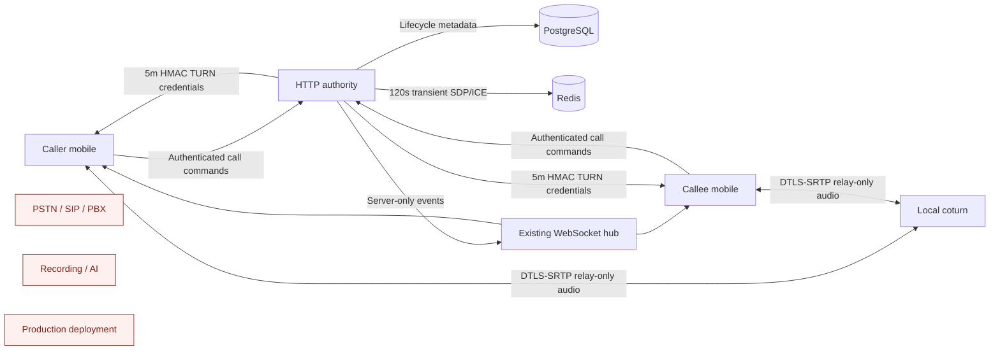

# DWCO 0.5 WebRTC architecture proposal

STATUS=DRAFT_FOR_ARCHITECTURE_AND_SECURITY_REVIEW

IMPLEMENTATION_AUTHORIZED=NO

## Component boundary



The media plane never passes through the application API. Coturn relays encrypted packets and does
not terminate DTLS-SRTP media. PostgreSQL is authoritative for lifecycle state; Redis is transient
signaling transport/storage only; WebSocket delivery remains best effort.

## Authority flow

```mermaid
sequenceDiagram
    participant C as Caller
    participant API as HTTP authority
    participant DB as PostgreSQL
    participant WS as WebSocket hub
    participant E as Callee
    participant TURN as Local coturn

    C->>API: Initiate(conversation, command, caller proof)
    API->>DB: Verify authority; persist ringing v1 + proof digest
    API-->>C: Call v1 + opaque caller-leg ID
    API->>WS: call.ringing v1
    WS-->>E: Best-effort ring event
    E->>API: GET call catch-up
    E->>API: Accept(call, version, command, callee proof)
    API->>DB: Persist accepted v2 and hashed callee-leg proof
    API-->>C: call.accepted v2 via WS
    C->>API: Request ephemeral TURN credential
    E->>API: Request ephemeral TURN credential
    C->>TURN: Relay-only ICE + DTLS-SRTP
    E->>TURN: Relay-only ICE + DTLS-SRTP
    C->>API: Signal offer/candidates with caller-leg proof
    API->>DB: Persist connecting v3
    API-->>E: Content-free signal.available revision
    E->>API: GET signal bodies after revision
    E->>API: Signal answer/candidates with callee-leg proof
    API-->>C: Content-free signal.available revision
    C->>API: GET signal bodies after revision
    C->>API: media-ready(version=3)
    E->>API: media-ready(version=3)
    API->>DB: Persist active v4 after both acknowledgements
```

## Design decisions requiring sign-off

| Decision | Proposed choice | Reason | Reviewer |
|---|---|---|---|
| Media scope | One-to-one audio only | Keeps state, device, privacy, and test scope bounded | Architecture + QA |
| Peer address privacy | `iceTransportPolicy=relay` | Prevents direct peer candidate/IP disclosure | Identity/Security |
| Durable authority | Authenticated HTTP + PostgreSQL | Preserves accepted DWCO 0.4 command/catch-up model | Architecture |
| Live delivery | Existing server-only WebSocket | Avoids a generic client publish surface | Architecture + Security |
| Transient signaling | Redis, TTL at most 120 seconds | Survives process boundary without durable sensitive storage | Security + DevOps |
| TURN credentials | HMAC-derived, participant/call-leg named, TTL at most 5 minutes | Reduces relay abuse and secret exposure | Security + DevOps |
| Background calls | Excluded | Requires push/native provider and mobile OS contracts | Mobile + Product |
| Media retention | None | Recording/transcription is explicitly prohibited | Security + Product |
| Metadata retention | 30 days | Minimises sensitive call history while preserving bounded participant history | Security |
| Deployment | Local development only | DEP-001, DEP-007, DEP-012 and capacity evidence remain open | DevOps/SRE |

WebSocket never contains SDP, ICE candidates, TURN credentials, call-leg proofs, or media. A
`voice.signal.available` notification contains only opaque call ID, current ICE generation, and
latest signaling revision; authenticated HTTP plus the matching call-leg proof returns bodies.

The seven decision records proposed for approval are indexed in
[`decisions/DWCO-0.5-ADR-INDEX.md`](decisions/DWCO-0.5-ADR-INDEX.md). Their exact state, actor,
call-leg, privacy, storage, lifecycle, local-runtime, and shared-scale boundaries are normative with
the implementation contract.

## Shared and production blockers

- Process-local WebSocket fan-out must be replaced or fronted by an approved shared broker.
- TURN topology, TLS certificates, realm/credential rotation, bandwidth, abuse prevention, and DDoS
  controls require a production design.
- Regional data handling, IP metadata, retention, consent, support, incident response, SLOs, capacity,
  backup/restore, and rollback require operational approval.
- Hosted CI attestation and protected required checks remain unavailable under DEP-001.
- Background incoming calling requires an approved push/native mobile capability.
- A digest-pinned coturn runtime, native WebRTC dependency/OS matrix, and exact resource limits have
  not yet been selected or approved; they are pre-implementation blockers, not implementation work.
