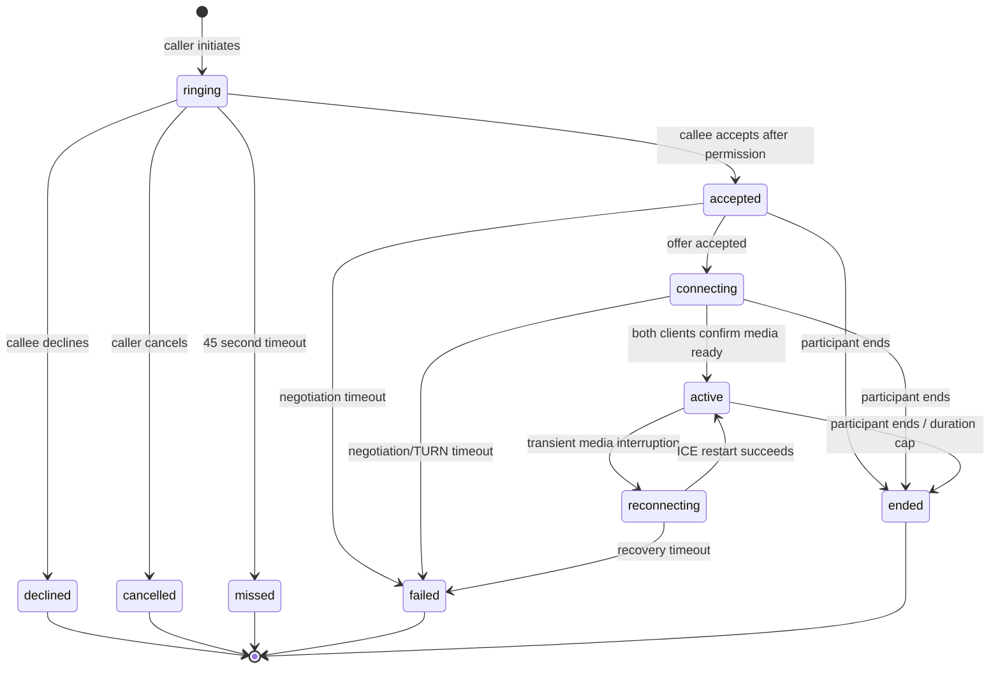

# DWCO 0.5 app-to-app voice/WebRTC contract

CONTRACT_STATUS=DRAFT_REVIEWED_BLOCKERS_OPEN

IMPLEMENTATION_STATUS=NOT_AUTHORIZED_NOT_STARTED

STAGE_WEIGHT=12_PERCENT

BASELINE=MAIN_9188ADC_DWCO_0.4_ACCEPTED

DEPLOYMENT_STATUS=NOT_AUTHORIZED_NOT_DEPLOYED

## Objective

Add secure, bounded, one-to-one audio calls between active members of the same tenant by extending
the accepted DWCO 0.4 conversation and realtime authority. This stage proves local call signaling,
consent, encrypted media establishment, lifecycle correctness, failure handling, and quality
evidence. It does not create a production telephony service.

## User-visible scope

- A participant can start an audio call from an existing direct conversation.
- The other active participant receives foreground ringing and can accept or decline.
- Both participants see deterministic calling, ringing, accepted, connecting, active, reconnecting,
  ended, missed, failed, declined, and cancelled states.
- Either participant can end an accepted call and mute or unmute their own microphone.
- The client presents clear microphone-permission, network, TURN, timeout, and reconnect errors.
- Each participant can view their own bounded call history. Administrators receive aggregate quality
  and failure counts only; no media, transcript, SDP, ICE candidate, IP address, or call content.

## Proposed design for review

1. Support one-to-one audio only between the two active same-tenant participants of an existing
   direct conversation. Video, screen sharing, group calls, guests, federation, and public calling
   are excluded.
2. Keep authenticated HTTP authoritative for call commands: initiate, accept, decline, cancel, end,
   TURN credential issue, lifecycle catch-up, and participant history. The existing server-only
   WebSocket channel carries best-effort lifecycle notifications and content-free
   `voice.signal.available` events containing only call ID and latest revision; clients fetch signal
   bodies through authorized HTTP. Clients do not gain a generic publish channel.
3. Persist only the bounded call lifecycle record and monotonic version in PostgreSQL. Treat each
   SDP or ICE envelope as transient signaling material with a maximum 120-second lifetime; never persist
   them in PostgreSQL, audit logs, security events, traces, metrics, or notification payloads.
4. Use WebRTC DTLS-SRTP for media. Default clients to relay-only ICE so one participant does not
   receive the other participant's network address. A separately isolated coturn service provides
   local TURN over UDP/TCP; the API issues HMAC-derived credentials with at most a 5-minute TTL.
   Static TURN usernames/passwords are not returned to clients or committed to source.
5. Require explicit callee acceptance and operating-system microphone permission before sending
   audio. The callee obtains permission before committing accept; the caller obtains permission only
   after receiving accepted state and before creating the offer. No recording, transcription,
   monitoring, supervisor listen-in, or media-content storage is
   implemented. No end-to-end identity-verification claim is made beyond authenticated participants
   and WebRTC transport encryption.
6. Use a server-enforced state machine and optimistic version on every mutation. Client call IDs and
   command IDs provide idempotency. Invalid, replayed, out-of-order, or cross-state commands fail
   without advancing the call.
7. Allow one non-terminal call per user, a maximum ring interval of 45 seconds, negotiation timeout
   of 60 seconds, maximum active duration of 4 hours, and ten call starts per actor per ten minutes.
   Exact values are configuration with bounded validation; production values require later review.
8. Retain participant-visible call records for 30 days, then exclude/purge them under the existing
   permissioned maintenance boundary. Store timestamps, terminal reason, duration, TURN UDP/TCP
   category, and coarse quality buckets only. Never store IPs, candidate strings, SDP, device labels,
   media, or precise network location.
9. Limit this stage to foreground mobile development builds and local browser/device validation.
   Expo Go compatibility, background wake, push notification delivery, CallKit, Android Telecom,
   lock-screen calling, and production app-store builds are separate contracts.
10. Preserve DEP-001 truthfully. Local fast/full/Docker evidence is mandatory, but cannot be called
    GitHub-attested CI. Merge, shared infrastructure, and deployment remain separate decisions.
11. Put voice behind a server-side local configuration flag and tenant allowlist that default off and
    have no runtime API/UI mutation. A reviewed DevOps/SRE configuration change plus restart is
    required to enable a local test tenant. Disabling it blocks
    new calls, signaling advancement, and TURN issuance while preserving authenticated catch-up and
    end/cleanup commands for bounded active local calls.
12. Bind a call to a caller leg and first accepting callee leg. Before its idempotent initiate or
    accept request, the device generates a 256-bit random base64url proof, retains it only in memory,
    and sends it in a header. The server stores only its digest and returns the opaque leg ID, never
    the proof. Retrying a lost response uses the same command ID and proof. The proof is
    required in addition to normal authentication for signaling and TURN issuance. It is not a
    replacement for current access-token/membership checks and is destroyed on logout, tenant switch,
    background, or terminal state. Other signed-in devices receive lifecycle state only. The first
    committed call for a canonical participant pair wins simultaneous glare.

## Call-state contract

Terminal states are immutable. Each accepted command increments `call.version`; stale versions return
a conflict and require authenticated HTTP catch-up.

## Normative limits and transition authority

| Control | Contract value |
|---|---|
| Ringing | 45 seconds |
| Negotiation/reconnect attempt | 60 seconds |
| Active call duration | 4 hours maximum |
| Concurrent calls | One non-terminal call per user; one per canonical participant pair |
| Initiation rate | 10 attempts per actor and 20 per target per rolling 10 minutes |
| SDP | `offer` or `answer` only; audio-only; 64 KiB maximum; one current SDP per role/generation |
| ICE | Trickle candidate or end-of-candidates; 2 KiB per candidate; 256 candidates per participant/generation |
| Signaling retention | 120 seconds per envelope; delete immediately after terminal state where practical |
| TURN credential | 5 minutes maximum; new opaque call-leg identifier on retry; no PII in username |
| Audio | Opus only for stage acceptance; 64 kbit/s configured maximum; no data channel |
| Call metadata | 30 days; tenant-scoped participant access; audited permissioned purge |
| Local capacity proof | 10 concurrent calls for 30 minutes; 20-call admission burst rejects safely |
| Revocation | Commands/events denied within 15 seconds; cooperative client teardown within 5 seconds; relay allocation hard-expires within 5 minutes |
| Signal catch-up | Current ICE generation only; 200 envelopes/page; 3 pages and 3 retry attempts maximum; expired gap returns resynchronization-required |
| Signaling rate | 120 envelopes per call leg/minute; contract candidate/generation cap also applies |
| TURN issuance/allocation | 3 credential issues per leg/call and 10 per user/10 minutes; 1 allocation/leg credential; 2 allocations/call; 24/tenant local maximum |
| TURN bandwidth/auth failures | 256 kbit/s/allocation and 6 Mbit/s/tenant local maximum; 5 failed allocations/minute/source triggers 10-minute cooldown |

The server derives roles from the durable call. Caller alone may cancel while ringing; callee alone
may accept or decline; either participant may end from `accepted`, `connecting`, `reconnecting`, or
`active`. Only the caller leg submits the offer and only the accepting callee leg submits the answer.
Both bound legs may submit ICE for their own role. The first accepted transition wins a
race; later stale or conflicting commands return the same terminal outcome or a non-enumerating
conflict without partial mutation. Terminal calls cannot be revived.

| State | Command/event | Authorized actor | Committed result |
|---|---|---|---|
| `ringing` | `accept` after microphone permission | Callee | `accepted`; validates/stores callee-leg proof digest |
| `ringing` | `decline` | Callee | `declined` terminal |
| `ringing` | `cancel` | Caller | `cancelled` terminal |
| `ringing` | ring deadline | Timeout reconciler | `missed` terminal |
| `accepted` | valid audio offer | Caller leg | Store transient offer; `connecting` |
| `accepted` | negotiation deadline | Timeout reconciler | `failed` terminal |
| `connecting` | valid audio answer | Callee leg | Store transient answer; state unchanged |
| `connecting` | first `media-ready` | Either bound leg | Record acknowledgement; state unchanged |
| `connecting` | second distinct `media-ready` | Other bound leg | `active` |
| `connecting` | negotiation deadline | Timeout reconciler | `failed` terminal |
| `active` | current-generation ICE restart | Either bound leg | `reconnecting`; clear prior readiness |
| `reconnecting` | two current-generation `media-ready` acknowledgements | Both bound legs | `active` |
| `reconnecting` | recovery deadline | Timeout reconciler | `failed` terminal |
| `accepted`, `connecting`, `reconnecting`, `active` | `end` | Either participant | `ended` terminal |
| `active` | four-hour deadline | Timeout reconciler | `ended` terminal |

`end` is invalid while ringing; the role-specific `cancel` or `decline` applies. Offer, answer, ICE,
and media-ready are idempotent for the same command/body digest. Accept-versus-cancel and every
deadline-versus-command race use a conditional version update under row lock: the first commit wins
and the loser returns the new authoritative state. Duplicate one-sided media-ready never activates a
call.

Each call row stores caller/callee directly; no duplicate participant table is proposed. A separate
`active_call_reservations` row for each tenant/user has a unique tenant-user key and references the
call. Initiation transactionally inserts both reservations in sorted user-ID order; any conflict
rejects the new call. A terminal transition deletes both reservations in the same transaction.

The bounded single-instance API runs an idempotent timeout reconciler every five seconds and also
reconciles an expired call lazily before every call read/command. It selects expired rows under lock,
applies the same conditional transition table, releases reservations, purges transient signals, and
then emits notifications. Startup runs reconciliation before voice readiness.

## Security and privacy invariants

- Tenant, actor, membership, and direct-conversation participation are server-derived for every call
  command, signaling event, credential issue, catch-up, and history request.
- Both users, their memberships, tenant, and conversation participation are active before initiate or
  accept and are revalidated on every mutation, credential issue, read, and fan-out.
- Only the intended callee can accept/decline; only a participant can cancel/end/catch up.
- Call-leg proofs are single-purpose and digest-stored. TURN REST/HMAC credentials are call-leg named,
  rate-limited, and reusable by a holder only until their five-minute expiry; they are not represented
  as one-use or immediately revocable by coturn. Credentials and proofs are excluded from URLs/logs.
- SDP/ICE inputs have strict content type, field count, size, candidate count, and lifetime limits.
- SDP, ICE, TURN credentials, tokens, raw IP addresses, and device labels are excluded from logs,
  audits, traces, metrics, crash reports, durable storage, and administrative responses.
- Media is encrypted in transit and relay-only by default; TLS is required for any non-local API,
  WebSocket, or TURN-over-TCP/TLS transport.
- Microphone capture starts only after explicit acceptance and permission. Local mute affects the
  sender track and is not represented as verified remote privacy control.
- Administrative access is aggregate and audited; ordinary call participation is not converted into
  an employee-surveillance stream.
- An authorization, Redis, signaling, or TURN outage fails closed for starting/advancing calls while
  durable HTTP state remains recoverable and no committed command is falsely reported as undone.
- Security-critical rate-limit, credential, or signaling-store unavailability fails closed. Existing
  messaging and presence remain available when the default-off voice feature is disabled.

## Data and API boundary

Proposed durable entities:

- `calls`: tenant, direct conversation, caller/callee, hashed caller/callee leg proof, state, version,
  readiness generation/flags, idempotent client call ID,
  timestamps, terminal reason, expiry, and bounded quality summary.
- `active_call_reservations`: one transactionally unique tenant/user reservation per participant and
  non-terminal call; removed with the terminal transition.
- No database table contains SDP, ICE candidates, TURN passwords, media, transcripts, or IP addresses.

Proposed HTTP families:

- `POST /calls` — initiate from a direct conversation.
- `POST /calls/{id}/accept|decline|cancel|end` — versioned idempotent lifecycle commands.
- `POST /calls/{id}/signals` — bounded transient offer/answer/candidate/ICE-restart envelope.
- `GET /calls/{id}/signals?after_revision=` — bounded call-leg catch-up in ascending order.
- `POST /calls/{id}/media-ready` — bound-leg acknowledgement; both are required for `active`.
- `GET /calls/{id}` and `GET /calls` — participant-only state catch-up/history.
- `POST /calls/{id}/turn-credentials` — participant-only ephemeral relay credentials.
- `POST /calls/{id}/quality` — coarse participant quality summary after terminal state.
- `GET /calls/admin/metrics` — permissioned aggregate counts without participant/media content.

The device supplies `X-Call-Leg-Proof` on initiate or accept and then on signal, media-ready,
ICE-restart, and TURN credential requests. Proofs contain at least 256 random bits, are base64url and
constant-time digest-checked, and are never returned or recoverably stored by the server. A lost HTTP
response is retried with the same idempotency key and in-memory proof. If a process loses the proof,
the leg cannot rebind in DWCO 0.5; the authenticated participant may end the call, allow its timeout,
and start a new call after terminal cleanup. Ordinary bearer authentication and current tenant
membership remain mandatory for every request.

`GET /calls` is the only DWCO 0.5 participant export: opaque cursor pagination, 50 records/page,
approved metadata fields only, and the 30-day window. Bulk or administrator export is deferred.

Endpoint paths may change during implementation review, but authority and data-minimisation
invariants may not change without contract amendment.

## Failure and recovery behavior

- WebSocket loss does not end an active peer connection. The client obtains a new realtime ticket,
  catches up call state through HTTP, and re-subscribes to server events.
- Media interruption enters `reconnecting`; a bounded ICE restart may return it to `active`.
- Server restart recovers durable call state, expires stale ringing/connecting calls, and requires
  fresh transient signaling; it does not claim media-session continuity.
- TURN, Redis, authorization-store, or microphone failure surfaces a specific non-sensitive terminal
  reason and cannot expose another tenant, participant, credential, or candidate.
- Duplicate initiate and lifecycle commands return the same authoritative outcome; simultaneous
  cross-calls use a transactionally enforced canonical participant-pair key: the first commit wins
  and the losing participant catches up the existing call.
- A gap beyond the bounded signaling window never silently truncates. The API returns an explicit
  resynchronization-required outcome and clients restart negotiation or fail the call visibly.
- Successful transport metadata is `turn_udp`, `turn_tcp`, or `unknown` only. A successful `direct`,
  `host`, or `srflx` value is a relay-only policy failure.

## Required implementation evidence

- Architecture decision record and threat model accepted before code begins.
- Schema migration round-trip and rollback with no DWCO 0.1–0.4 regression.
- Unit, API, state-machine/property, mobile controller, integration, and adversarial tests.
- Two-client local call proof using relay-only TURN, plus forced TURN/UDP/TCP failure and recovery.
- Tenant isolation, participant authorization, suspension/revocation, replay, glare, stale-version,
  idempotency, signaling bounds, credential expiry, history, retention, and admin-privacy tests.
- Network impairment matrix covering latency, jitter, packet loss, disconnect, reconnect, ICE restart,
  and explicit failure UX; no subjective "sounds good" acceptance.
- Backend/admin/mobile/governance tests, types/builds, dependency audits, migration round-trip,
  isolated Docker readiness, and live governance pre/post health.
- Completion report with files/schema/API/security/tests, quality results, rollback, residual risks,
  remote CI truth, and deployment status.

## Pre-implementation design blockers

| ID | Owner | Required closure evidence |
|---|---|---|
| VBL-01 | Implementation Director | Approve the exact final contract commit and bounded product semantics; PR #25 baseline closure is already merged at `9188adc` |
| VBL-02 | Architecture | Accept the seven proposed decisions in `docs/architecture/decisions/` and the single-instance/shared-scale deferral |
| VBL-03 | Identity/Security | Accept `docs/security/DWCO-0.5-VOICE-THREAT-MODEL.md`, revocation limits, consent, metadata, and abuse boundaries |
| VBL-04 | Mobile + Voice/WebRTC | Select and approve a version-pinned, license-clean native WebRTC dependency, minimum iOS/Android matrix, and reproducible development-build plan; executable proof is pre-merge evidence |
| VBL-05 | DevOps/SRE | Select and approve the coturn repository/image digest, exact local ports/relay range, secret injection, hardening, resource/quotas, readiness design, and scoped cleanup; executable proof is pre-merge evidence |
| VBL-06 | QA/Validation | Accept the design, fixture ownership, artifact manifest, QA-01 through QA-16, and V01 through V32; results are pre-merge evidence |
| VBL-07 | Architecture + Identity/Security | Accept call-leg proof, bounded credential reuse, state/timeout/reservation, content-free notification, feature configuration, and export decisions |
| VBL-08 | Implementation Director + DevOps/SRE | Keep DEP-001, DEP-007, and DEP-012 open; separately approve any shared/staging environment before deployment |

No product implementation branch may begin while any design blocker is open. Suggested versions,
ports, capacity,
or dependency choices are not accepted merely by appearing in a draft; required reviewers must record
their decision against an exact commit.

## Pre-merge acceptance blockers

- All QA-01 through QA-16 and V01 through V32 tests pass without a required flaky/not-run result.
- Native development builds and two-device relay-only calls prove the approved dependency matrix.
- The digest-pinned isolated coturn stack proves allocation/relay readiness, limits, secret handling,
  cleanup, failure injection, rollback, and application/governance coexistence.
- Exact-tree fast/full/Docker regressions, migrations, audits, builds, scans, and evidence manifest pass.
- Architecture, Identity/Security, DevOps/SRE, QA/Validation, and Implementation Director accept the
  implementation exact commit; remote CI and DEP-001 are reported truthfully.

## Ownership and required review

ACCOUNTABLE=Implementation Director

RESPONSIBLE=Voice/WebRTC,Backend,Mobile,Realtime

REQUIRED_REVIEWERS=Architecture,Identity/Security,DevOps/SRE,QA/Validation

CONSULTED=Integration,Admin Web

HANDOFF_FIELDS=HANDOFF_ID,CONTRACT_ID,STAGE,SOURCE_BRANCH,SOURCE_COMMIT,FROM_AGENT,TO_AGENT,OBJECTIVE,IN_SCOPE,OUT_OF_SCOPE,FILES_CHANGED,DATABASE_CHANGES,API_CHANGES,SECURITY_AND_PRIVACY_CHANGES,DEPENDENCIES_AND_ASSUMPTIONS,TESTS_RUN,TEST_RESULTS,REMOTE_CI_STATUS,LOCAL_CI_STATUS,KNOWN_ISSUES,DEFERRED_SCOPE,DEPLOYMENT_STATUS,ROLLBACK_GUIDANCE,REVIEWERS_REQUIRED,OPEN_DECISIONS,NEXT_ACTION

## Explicitly excluded

- PSTN, SIP, PBX, phone numbers, emergency calling, carrier interconnect, and lawful intercept.
- Recording, voicemail, transcription, AI summaries, sentiment, scoring, or training.
- Video, screen sharing, group calls, external guests, federation, and public call links.
- Background push delivery, CallKit, Android Telecom, lock-screen UI, and provider credentials.
- Production TURN, production WebRTC calling, production data, deployment, billing, payments, eSIM,
  Teams, CRM, or other business integrations.

## Rollback boundary

Before any local migration, stop clients and back up non-disposable development data. Rollback must
disable new calls and credential issuance, drain or explicitly end bounded active calls, stop the
isolated local coturn/signaling services, remove only voice-test resources, purge ephemeral signals,
downgrade the DWCO 0.5 migration to the DWCO 0.4 head only after backup/compatibility review, and
revert the bounded implementation commits. Existing presence and messaging must stay healthy. Rollback never
authorizes modification of production data or infrastructure.

## Approval gate

This draft does not authorize implementation. Architecture, Identity/Security, QA/Validation, and
DevOps/SRE must accept the linked design and validation plan, and the Implementation Director must
record final approval in `docs/reviews/DWCO-0.5-CONTRACT-APPROVAL.md` before code begins.
