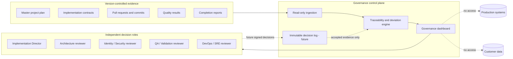
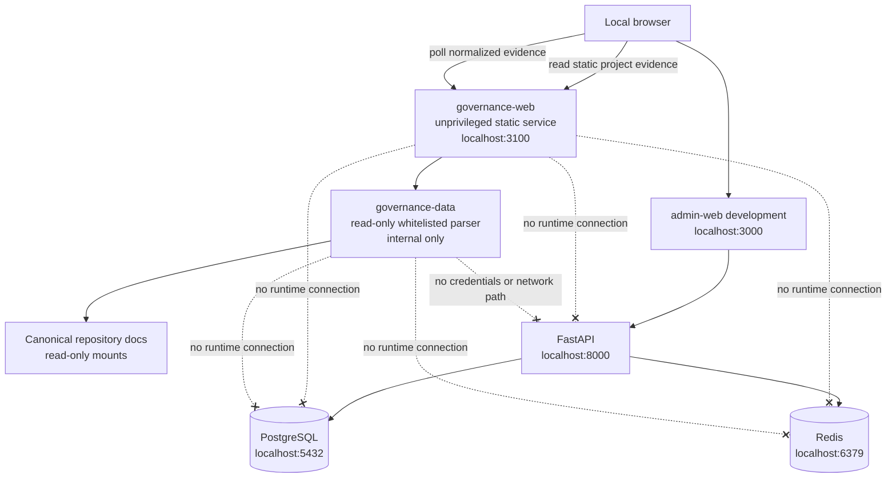
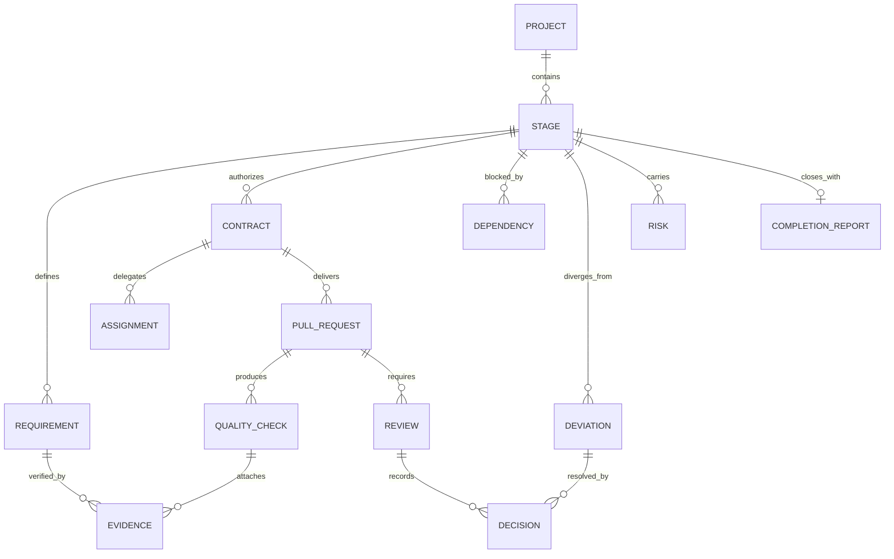
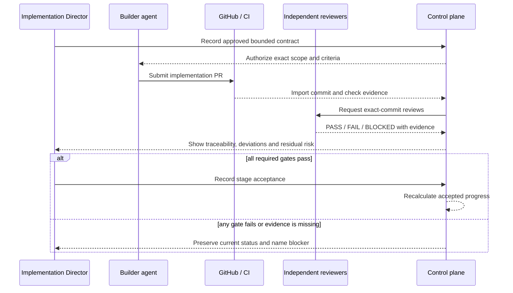
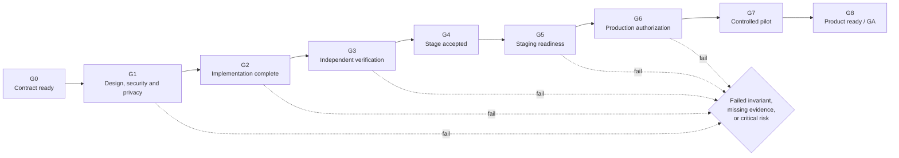

# Governance control-plane project plan

## Purpose

Create a centralized, evidence-driven project record and control plane for the Implementation
Director and independent reviewers. It tracks the approved plan, requirements, stages, pull
requests, checks, risks, deviations, decisions, and next authorized action without becoming a path
to customer data or production control.

DWCO-GOV is an internal governance stream. It does not add product-stage completion weight and
cannot change the status recorded in `PROJECT_STATUS.md` without an accepted evidence record.

## Safety model

The first release is a read-only local template. Future capabilities progress from trusted import,
to authenticated review workflow, to carefully controlled GitHub status integration. Merge,
deployment, secrets, and production operations remain outside the control plane unless separately
approved.

## Current Docker topology

The governance container is isolated and does not join the application data path. Its distinct port
avoids the admin development server and existing infrastructure ports.

## Governance record model

## Evidence and acceptance flow

## Product-readiness gates

## Delivery phases

| Phase | Capability | Security boundary | Exit gate |
|---|---|---|---|
| GOV 0.1 | Local read-only dashboard template | No credentials, APIs, persistence, or mutations | Docker/local validation |
| GOV 0.2 | Trusted document and GitHub read ingestion | Read-only token, minimal scopes, signed inputs | Data accuracy and threat review |
| GOV 0.2A | Live local document ingestion | Whitelisted read-only mounts, no credential or external network | Parser, freshness and isolation evidence |
| GOV 0.2B | GitHub PR/check read ingestion | Read-only token, minimal scopes, server-side adapter | Permission, data accuracy and threat review |
| GOV 0.3 | Authenticated role-based review workspace | MFA, least privilege, audit, no self-approval | Independent security/QA acceptance |
| GOV 0.4 | Requirements, defects, risks, deviations, waivers | Immutable history and expiring waivers | Traceability and conflict-of-interest tests |
| GOV 0.5 | CI status/check integration | Signed webhooks; no false remote-pass representation | Remote CI and branch protection active |
| GOV 0.6 | Staging release-readiness records | Evidence only; no deployment execution | SRE and release review |
| GOV 1.0 | Production-ready governance plane | Separate deployment authorization and operations | Pen test, DR, SLO and privacy gates |

## Required quality checks

- Requirement-to-contract-to-code-to-test-to-evidence traceability.
- Exact commit SHA, environment, commands, results, artifacts, reviewer, and timestamp.
- Architecture, Identity/Security, DevOps/SRE, and QA/Validation independence.
- Severity, defect owner, exit evidence, waiver owner, and waiver expiry.
- Accessibility, responsive layout, failure/empty/loading states, and device/browser review.
- Threat model, data classification, token scopes, webhook signing/replay, and audit integrity before
  any live integration.
- Backup/restore, rollback, observability, SLO, incident, and release rehearsal before production.

## Global stop conditions

No merge, accepted stage credit, or deployment proceeds when scope is unapproved; tenant/security
invariants fail; required evidence is missing, failed, flaky, or not tied to the exact commit; the
reviewer is not independent; a destructive migration lacks rollback proof; secrets or sensitive data
are exposed; a provider/legal dependency is unapproved; or critical/high risk remains unresolved.

## Next approval checkpoint

Accept GOV 0.1 as a local UI template only. Before GOV 0.2, approve the ingestion architecture,
GitHub permission scopes, source reconciliation rules, data classification, authentication/RBAC,
audit model, and an explicit rule that the control plane cannot merge or deploy.
Review GOV 0.2A as a credential-free local live-evidence reader. Before GOV 0.2B, approve GitHub
permission scopes, source reconciliation rules, data classification, credential storage and
rotation, rate/failure handling, audit model, and an explicit rule that the control plane cannot
merge or deploy.
